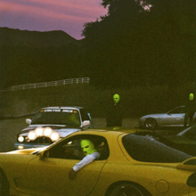

I really like the color palette of the album cover. I love the color of the sky, and the neon ski mask's pop so much. 

 ## HIGHEST IN THE ROOM REMIX
The initial release of this song was a bit of a disappointment. I love Travis Scott, but 
this beat was a little boring, and I thought it felt a little monotone without a feature.
Thankfully, Travis made a remix, and I think the features really improved the song.
I love Rosalia's verse, and adlibs. Her voice has a dreamy effect on me. I don't think Lil Baby
really fits with Rosalia & Travis Scott. However, I did like the flow on his verse.
 ## JACKBOYS
Introduction song. Kinda feels like the introduction to a movie. Decent background music.

 ## GANG GANG
A forgettable song. Personally not a big fan on Sheck Wes. Beat was simple, no one had a memorable verse. 

 ## HAD ENOUGH
Don Toliver is polarizing rapper for me. I first heard him on Astroworld through his feature on "Can't Say". I like his flow and the way he rides the beat, but I also think he sounds one dimensional. It sounds like he uses the same flows on every song. Offset had a good verse, he brought his trademark flow. Hated Quavo, I think the amount of auto tune on his voice is distracting. The beat is nice, but not memorable. 

 ## OUT WEST
Absolute banger. Buddha really blessed this beat. It might be early, but I think this is the beat of the year. Young Thug demolishes this song. His flow is so good, and I love the energy he brings in the track. Travis and Thug are such a good combo. Vibes in this bitch!!

 ## WHAT TO DO?
Chill psychedelic song, but its just really forgettable.

 ## GATTI
Initially I hated this song. It's kind of like listening to Playboy Carti for the first time. You can't help but think, "Why does his voice sound like that?" However, Pop Smoke's (RIP) deep husky voice has really grown on me. AXL Beats is also one of my recent favorite producers. I've been listening to some UK music, so I like this drill sound. Pop Smoke has a heavy sound, so it was nice to hear Travis' verse come in and switch up the flow. 

## Conclusion:

Loved: Out West

Liked: Gatti, Highest in the Room Remix

Dislike: Gang Gang, What To Do

I think Travis wanted to showcase the talent he has signed to his record label, and to give them some exposure. Overall, I think only Don Toliver was showcased properly, while everyone else was not as present. Young Thug stole the show on "Out West". Not bad for a compilation album, but I expected more from the production.

## **Final Score: 6/10**

#### FAVORITE SONG:

<iframe width="100%" height="300" scrolling="no" frameborder="no" allow="autoplay" src="https://w.soundcloud.com/player/?url=https%3A//api.soundcloud.com/tracks/733487464&color=%23ff5500&auto_play=false&hide_related=false&show_comments=true&show_user=true&show_reposts=false&show_teaser=true&visual=true"></iframe>

