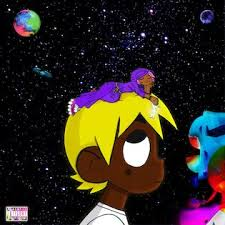

Finally after two years, we finally have a new Lil Uzi Vert album. I have to be honest with myself, Eternal Atake was mild considering the hype coming into this project. However, a week after Eternal Atake released, Lil Uzi Vert decides to drop a second album attached to Eternal Atake as part of a deluxe edition. I've had time to listen to this album extensively since it's release, and I have to say this is the Lil Uzi that I expected.

 ## Myron
When I listen to Lil Uzi Vert, there are two things I'm looking for. A variety of eccentric beats and catchy melodic hooks. Myron is a great start to the album. Myron sets the tone for the rest of the album. I'm expecting to hear some outer spacey trap beats, exciting flows, and fun quotable mindless lyrics.

 ## Lotus
This beat reminds me of the music from Pokemon's Lavender Town. I hated Lavender Town as a kid, so it's no surprise that I didn't like this song. I just feel like the individual instruments on the beat didn't complement each other.

 ## Bean (Kobe) (feat. Chief Keef)
First of all, Chief Keef is a modern hip hop pioneer. This guy influenced so many rappers and popularized drill music. I'm really happy to see that Chief Keef is still relevant in rap today, and I'm proud to see his growth since 2012. Lil Uzi and Chief Keef is a combo that I didn't know I needed. Pierre Bourne does it again. This beat is a banger to the highest degree. I'm getting real 2016 Lil Uzi vibes. The hook is a repetitive, but it's so infectiously fun. Chief Keef had a great verse. Fun track. RIP KOBE!

 ## Yessirskiii 
2/2 for Pierre Bourne. One thing I love about Pierre's beats is that they're so unique. There is no producer out there that sounds like Pierre right now. Some straight video game music, his tracks are a blast to listen to. I'm proud of 21 Savage's growth. This man has a Grammy!! I was unimpressed by 21 Savage when blew up in 2016, but I look forward to every one of his releases/features since I am > I was dropped. His ability to just flow with any beat is incredible. It's crazy to see the growth of the 2016 XXL Freshmen class. They all have seen mainstream rap success. I was surprised to hear that this song is one of the first collabs between members of the 2016 class. Both of them had good verses. Certified SLAP.

 ## Wassup (feat. Future)
This song is the embodiment of Lil Uzi to me. Repetitive hook, outer spacey trap beat, big guest feature. Mediocre feature by Future. I feel like I would like this song more if Bean (Kobe), didn't exist. At least this song adds to the album's cohesion.

 ## Strawberry Peels (feat. Young Thug & Gunna)
 Okay now this is where repetitive hooks start to wear me down. I can deal with a repetitive hook as long as its fun to repeat. It's like they chose two words out of the dictionary at random, and decided to turn that into a hook. I'm a huge Young Thug fan, but I don't think Thug or Gunna added that much to the track. Sounds like a filler track that could have been cut.

 ## I Can Show You
I feel like this song doesn't fit thematically overall with the album. I understand that this album in general is not really meant to be cohesive. These songs are have been asked for by fans for years, after they heard snippets through Instagram Live. This song just doesn't do much for me. 

 ## Moon Relate
A lot of people put this song on their favorites, but personally I don't like it that much. I can appreciate the beat, but I don't like Lil Uzi's voice here. Kinda feels whiny? not really sure what word I'm looking for.

 ## Come This Way
I don't know what it is about this song, but the melody just puts me in a nostalgic introspective mood. Good flow, fun hook. 

 ## Trap This Way
 I expected more from this one. Thought the start was good, a nice change up in the last couple beats. But I don't think the beat developed like I thought it would. I just think the beats are starting to get stale to me. Same hats, claps, drums. 

 ## No Auto (feat. Lil Durk) 
I think Lil Durk is a nice switch up on the feature list. The other guy's on the feature list are more melodic mumblin' rappers. Lil Durk is a spitter, and that turns Lil Uzi into a spitter for this song too. Unfortunately, the bars are generic and stale. I encourage Lil Uzi to rap like this more, but find some new material to rap on. 

 ## Money Spread (feat. Young Nudy)
This is gonna be specific as hell, but when I hear this beat I feel like I'm playing GoldenEye. It just feels like I'm on some sort of espionage mission. I like Uzi's flow, but Nudy sounds like Uzi too much. I don't think he adds anything dynamic to the song. Decent beat, verses let it down. 

 ## Got the Guap (feat. Young Thug)
Vintage Young Thug. I'm seriously one of Thug's biggest fans. He is so influential to the modern rap game. He can produce sounds with his voice that nobody else can. Thug's flow cannot be copied. I get a dance/edm influences in this song, however the beat is a little forgettable.

 ## Leaders (feat. Nav)
FIrst things first, I hate Nav. I can not understand the appeal of his robotic monotone voice. With that said, this might be the best Nav verse he's ever spit. I see the appeal of Nav now. He can produce catchy smooth flows. Pair that with a fire beat, and it's a fire track. This beat sounds like a trap Outer Space Nintendo Wii menu music, which I enjoy a lot. I actually have enjoyed almost every Lil Uzi/Nav collab. Add this one to the list.

## Conclusion:

Loved: Myron, Bean (Kobe), Yessirskiii, Leaders 

Liked: Come This Way, Got the Guap

Dislike: Strawberry Peels, Lotus

The highs on this album are worth sitting through the filler cuts on the album. I had a lot of fun listening to this album, and I have to give credit to Uzi's beat selection. I definitely enjoyed this more than Eternal Atake. He's potentially going to drop more music later this year and I'm here for it.

## **Final Score: 7/10**

#### FAVORITE SONG:
Tie between Yessirskii and Bean.

<iframe width="100%" height="300" scrolling="no" frameborder="no" allow="autoplay" src="https://w.soundcloud.com/player/?url=https%3A//api.soundcloud.com/tracks/775483780&color=%23ff5500&auto_play=false&hide_related=false&show_comments=true&show_user=true&show_reposts=false&show_teaser=true&visual=true"></iframe>

<iframe width="100%" height="300" scrolling="no" frameborder="no" allow="autoplay" src="https://w.soundcloud.com/player/?url=https%3A//api.soundcloud.com/tracks/775542334&color=%23ff5500&auto_play=false&hide_related=false&show_comments=true&show_user=true&show_reposts=false&show_teaser=true&visual=true"></iframe>